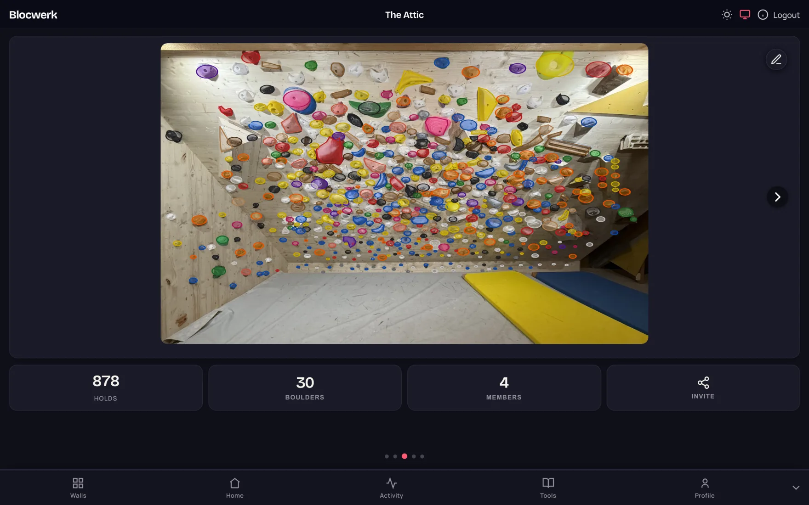
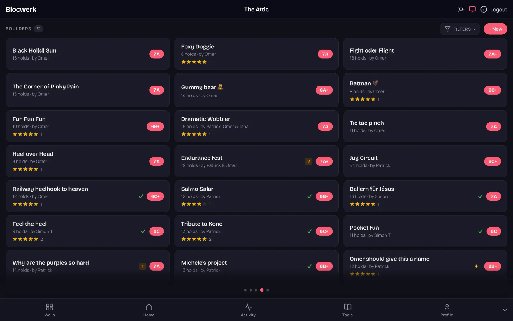
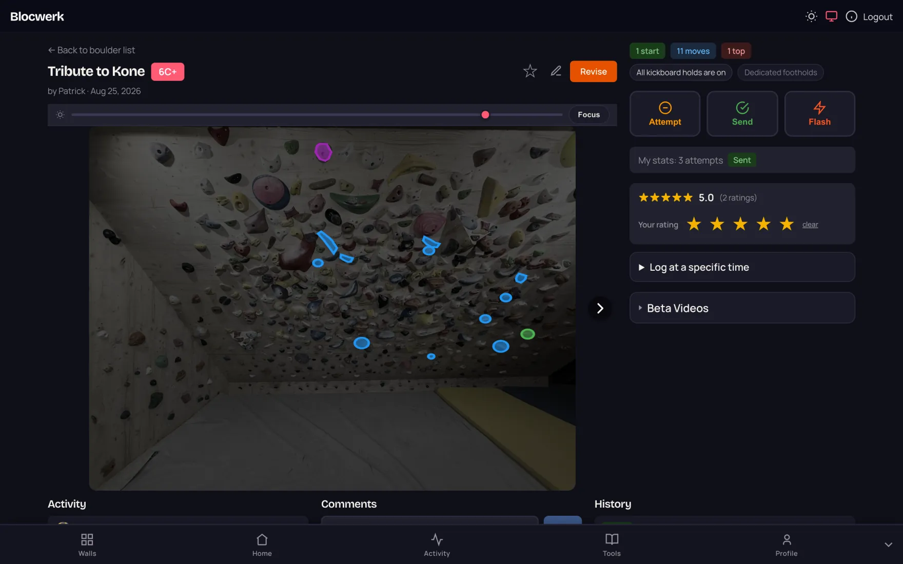
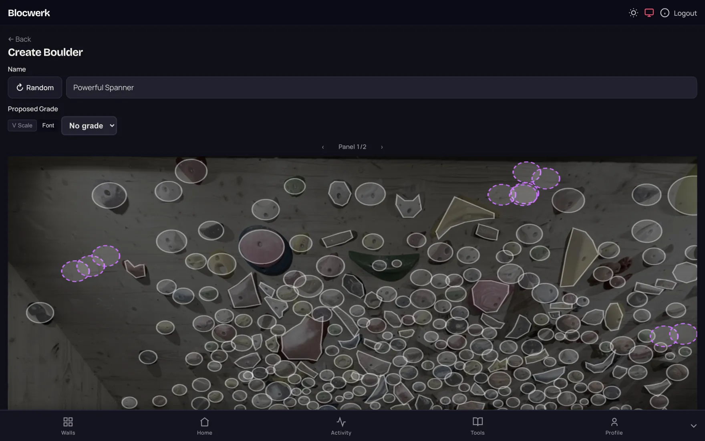
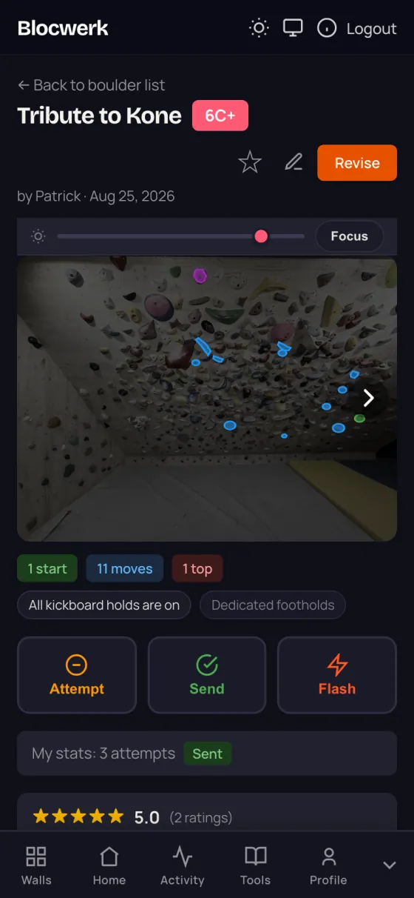
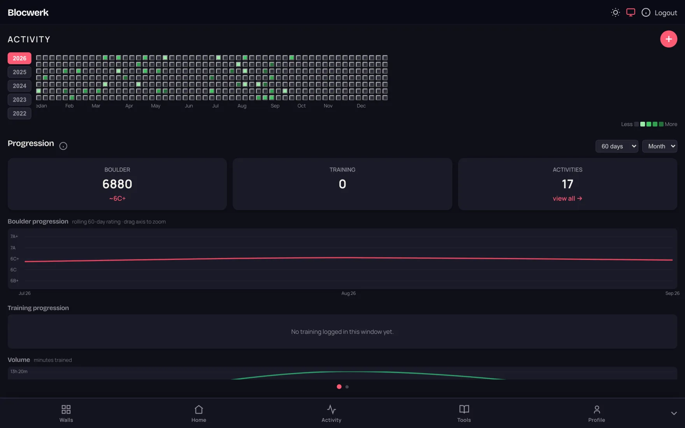
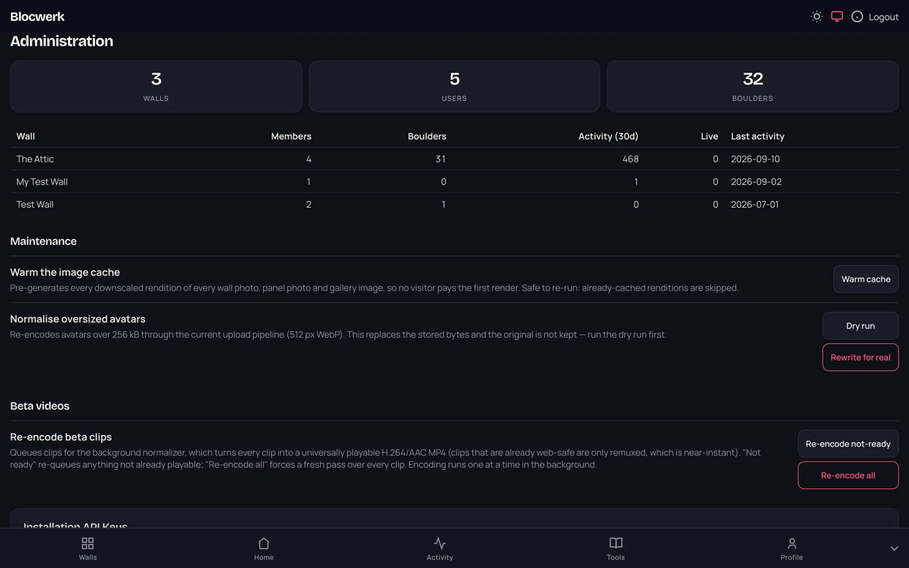

# Blocwerk

[](https://github.com/zannagh/blocwerk/releases)
[Release&logo=github)](https://github.com/zannagh/blocwerk/releases)
[](https://github.com/zannagh/blocwerk/actions/workflows/main.yml)
[](https://github.com/zannagh/blocwerk/actions/workflows/codeql.yml)
[](LICENSE)

<p align="center">

</p>

<p align="center">
A self-hostable app to set, share and track boulders on your home wall. Take a photo of the wall, let it find the holds, pick a few of them into a line, and log your attempts, sends and flashes. Built for one wall and the handful of people who climb on it, not for a commercial gym.
</p>

<p align="center">

</p>

### Features

Blocwerk is built around the thing that makes home walls annoying to track: the wall keeps changing. Holds get stripped, moved and re-set, and everything you ever set on it should survive that. Most of the design follows from there.

* **Set your wall up from photos.** One photo for a small wall, a grid of panel photos for a big one, plus the overhang angle so grades and progression reflect what you actually climb on.
* **Holds are detected for you.** A YOLO model finds the holds, and an editor lets you fix what it got wrong: move, reshape, recolour, delete, or add the ones it missed.
* **Set boulders by picking holds.** Start, normal and top holds, plus a foothold rule (all kickboard holds on, or only the ones you marked). Save as a draft or publish, name it yourself or let it name one for you.
* **Font and V grades.** Pick the system you think in and everyone else still sees theirs. If a grade is optimistic, others can propose a different one.
* **Tick attempts, sends and flashes.** Sessions start and end on their own and get grouped into activities, so you do not have to remember to press start.
* **Progression that means something.** A rolling rating with an equivalent grade, training volume, and a per-year activity grid.
* **Wall updates that do not throw your boulders away.** When you reset part of the wall, a guided update carries over the holds that stayed, links the ones that moved between panels, and flags the boulders whose holds actually changed. Old boulders stay viewable at the wall generation they were set on.
* **The social bits.** Star ratings, favourites, comments, multiple setters per boulder, and beta videos.
* **Sharing.** Read-only links for a whole wall or a single boulder, and invite links for actual members.
* **Kiosk mode.** A tablet on the wall registers itself, an admin approves it from their phone, and whoever is climbing just taps their name to log ticks. No logging in with chalky hands.
* **Training log.** Hangboard and pull-up sets, counted into the same progression.
* **Installable as a PWA.** Attempts, ratings, favourites and comments are queued offline and replayed when the wifi comes back.
* **A public REST API.** Personal and wall-scoped API keys. I use a wall key for a Raspberry Pi that posts the attic temperature and uploads a photo of the wall.
* **TopLogger import.** Pull your gym ascents in and map the gym's grades onto your own.
* **Optional extras.** Web Push notifications, SMTP for signup and password recovery, an admin dashboard, and a Prometheus endpoint.

#### Finding a boulder

Every boulder on the wall in one list, with its hold count, who set it, what people rated it and the grade in your own system. Filters narrow it down, and anything whose holds changed in the last wall update is flagged so you know it needs another look.

<p align="center">

</p>

#### Setting a boulder

The wall photo dims down so the line you are looking at is the only thing that stands out. Attempt, send and flash are one tap away, and the rules of the boulder are spelled out rather than implied.

<p align="center">

</p>

Creating one works the same way, except every detected hold is outlined and you tap the ones you want. Multi-panel walls get a panel switcher, so a big wall does not turn into one unusable photo.

<p align="center">

</p>

#### On the phone

The whole thing is mobile first, because that is what you actually have on you between attempts. It installs as a PWA, and ticks you log while the wifi is down get replayed once it comes back.

<p align="center">

</p>

#### Progression

<p align="center">

</p>

### Self-hosting

The published image is `ghcr.io/zannagh/blocwerk`, multi-arch for `linux/amd64` and `linux/arm64`. There is a working compose file at [`docker/docker-compose.yml`](docker/docker-compose.yml) with Postgres, the app and an OpenTelemetry dashboard. Start from that one, it has the reasoning behind each setting in comments.

```bash
cp docker/appsettings.template.json docker/appsettings.json
# edit docker/appsettings.json, then
docker compose -f docker/docker-compose.yml up -d
```

The app listens on port 5050 over plain HTTP and expects a reverse proxy in front of it for TLS. Mine is Caddy. Forwarded headers are honoured.

A few things worth knowing before you run it:

* **`appsettings.json` wins over environment variables.** Settings are read from the JSON section first and fall back to the env var. If you set `WALLIMAGE__STORAGEPATH` but also have a `Blocwerk:WallImage` section in the mounted JSON, the JSON wins and your volume mount quietly does nothing. Leave a section out of the JSON if you want to drive it from the environment.
* **Mount `./dpkeys:/app/keys`.** That is the DataProtection key ring. Without it, every redeploy logs everyone out and makes kiosk registrations, TOTP secrets and TopLogger tokens unreadable.
* **The detection model is not in the repository.** It is about 100 MB, so it is gitignored. Put `climbingcrux.onnx` at `src/Blocwerk.HoldDetection/models/` before building, or point `HOLDDETECTION__MODELPATH` at wherever you keep it. The model comes from [climbingcrux_model](https://github.com/mkurc1/climbingcrux_model).
* **Email, push and TopLogger are all optional.** Leave `SMTP__*` and `VAPID__*` empty and those features stay dormant instead of breaking.
* **Signing in with a personal API key is off by default.** It exists for automation (Playwright) against an instance you control. See [`docs/api-key-login.md`](docs/api-key-login.md) before setting `BLOCWERK__AUTH__APIKEYLOGIN__ENABLED`. It also needs an allow-list of user ids, and the same page covers `Blocwerk:Server:TrustedProxies` for the forwarded-headers trust.
* Wall photos, panel photos and avatars live in Postgres. Gallery uploads, beta video clips and the derived image cache live on disk, so give them volumes.

<p align="center">

</p>

### Building from source

Needs the .NET 10 SDK and a Postgres to talk to.

```bash
# Postgres
docker compose -f docker/docker-compose.yml up -d postgres

# Run it
dotnet run --project src/Blocwerk.Web

# Tests
dotnet test
```

It runs on port 5050 because 5000 is taken by AirPlay on macOS. Migrations are applied automatically at startup, so there is no separate database setup step.

The solution is four projects: `Blocwerk.Core` (entities, services, EF Core, no project references of its own), `Blocwerk.Authentication`, `Blocwerk.HoldDetection` (ONNX detection and the OpenCV matcher) and `Blocwerk.Web` (Blazor Server, the REST API and everything user-facing).

Two honest limitations while you are in there: the model detects holds but does not segment their shape, so hold outlines are an eight-point polygon you adjust by hand, and its colour classification is bad enough that recolouring with the paint tool is part of the normal workflow.

### Versioning and releases

Versioning is handled by [GitVersion](https://gitversion.net/) and the images are published to GHCR by the `Main` workflow.

* **Prereleases** are created automatically on every push to `main` that changes code. Commits prefixed `ci:`, `docs:`, `build:` or `chore:` are skipped.
* **Releases** are created manually through GitHub Releases.
* Both push `ghcr.io/zannagh/blocwerk` tagged with the version, and `latest` from `main` and releases.
* Versions look like `0.1.1` for releases and `0.1.2-17` for prereleases.

Production pulls new images by polling GHCR on a schedule rather than exposing an inbound webhook, and it waits on `/health/ready-to-deploy` so a deploy never lands in the middle of somebody's wall update.

### Issues and feature requests

Open an issue on the [GitHub repository](https://github.com/zannagh/blocwerk/issues). This is a hobby project for my own attic, so I make no promises about turnaround, but bugs do get fixed.

### License

Blocwerk is licensed under the [GNU AGPL v3](LICENSE).
